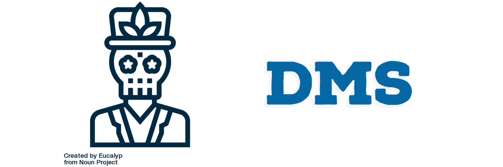

 
# Dead Man's Switch

We all know what a dms is... If not, do some research starting from the [wikipedia page](https://en.wikipedia.org/wiki/Dead_man%27s_switch) please :)

## ⚠ Disclaimer ⚠

This software is in beta stages, it is not properly tested and some flags aren't even implemented.

## Description

This Dead Man's Switch project has to run on a server with consistent uptime, it should be running this program in the background. It will send an email, then it expects an HTTP GET request with a token on port 9999 on the server. If that request won't arrive in a configured time span, the program will send the stored secret key to all the recipients that you specified. 

## Install

Clone the repo, then:

```bash
make ARCH=amd64 OS=linux DYNAMIC=0 build
```

You'll need the go compiler to build the package.